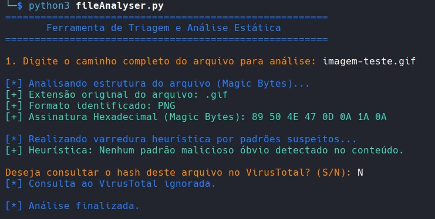
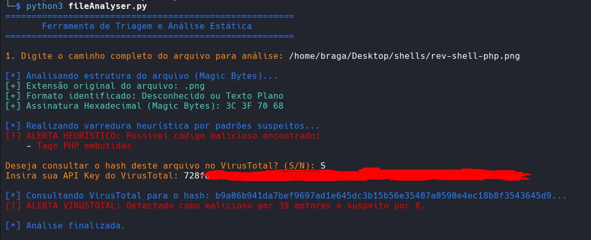
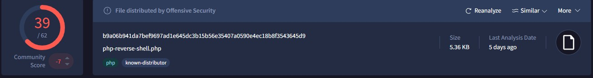

# 🛡️ File Analyser CLI - Analisador Estático de Arquivos


- Ferramenta interativa de linha de comando (CLI) desenvolvida em Python para triagem rápida e análise estática de arquivos.
- O script combina validação de assinaturas de arquivo, varredura heurística de conteúdo e inteligência de ameaças para identificar potenciais riscos, como *web-shells* embutidas em arquivos aparentemente inofensivos.
- Integração com a plataforma _VirusTotal_ para análise de hashes.

---

## ✨ Funcionalidades

* **Validação de Magic Bytes:** Identifica o verdadeiro tipo do arquivo analisando seu cabeçalho hexadecimal, mitigando técnicas de *spoofing* de extensão (ex: um script `.php` renomeado para `.jpg`).
* **Análise Heurística Anti-Malware:** Varre o conteúdo bruto do arquivo (em modo binário) utilizando Expressões Regulares (Regex) otimizadas para detectar:
    * Tags PHP embutidas (`<?php`, `<?=`).
    * Funções perigosas de execução de comandos (ex: `system`, `shell_exec`, `passthru`).
    * Tentativas de execução dinâmica e ofuscação (`eval`, `base64_decode`).
    * *Nota: O motor heurístico possui tratamento para reduzir falsos positivos em arquivos de alta entropia, como imagens de alta resolução.*
* **Integração com VirusTotal (API v3):** Calcula o hash SHA-256 do arquivo localmente e o consulta na base de dados do VirusTotal para verificar se a amostra já foi catalogada como maliciosa por motores de antivírus globais.
* **Interface Colorida (ANSI):** Saídas formatadas e codificadas por cores para facilitar a leitura visual rápida no terminal.

## 🔧 Casos de Uso

* **Forense**: Análise de arquivos para identificação de sua verdadeira extensão, auxiliando na descoberta de arquivos aparentemente inofensivos, com códigos maliciosos embutidos.
* **Application Security (AppSec):** Teste de validação e bypass de mecanismos de upload de arquivos em aplicações web.
* **Offensive Security & Pentest:** Triagem rápida de artefatos ou validação de *payloads* e *web-shells* customizadas.
* **SOC / Incident Response:** Análise inicial e estática de anexos suspeitos baixados por usuários.

## 📋 Pré-requisitos

Para rodar a ferramenta, você precisará apenas do Python 3.x e da biblioteca `requests` instalada.

```bash
# Clone o repositório
git clone https://github.com/LucasBragaCyber/FileAnalyser.git
cd fileAnalyser
```
-  Instale as dependências
```bash
pip install requests
```
> Opcional: Para utilizar a verificação de hash em nuvem, crie uma conta gratuita no VirusTotal e gere uma API Key. <br>

## Como Utilizar

1. Execute o script principal via terminal. A interface é guiada passo a passo.
```bash
python3 fileAnalyser.py
```
2. **Exemplo de fluxo de execução:**

- O script solicitará o caminho absoluto ou relativo do arquivo.
- Exibirá a extensão original vs. o formato real detectado pelos Magic Bytes.
- Executará a varredura heurística silenciosamente, alertando apenas se encontrar padrões maliciosos.
- Perguntará se deseja validar o hash no VirusTotal (_requer inserção da API Key no prompt_).

## 💻 Demonstração do programa

1. **Teste com arquivo de extensão alterada:**



2. **Teste com arquivo malicioso e extensão alterada + Validação no VirusTotal**



Confirmação no VirusTotal:



---
## 👤 Autor
- Feito por **Lucas Bragagnolo** 🛡️
